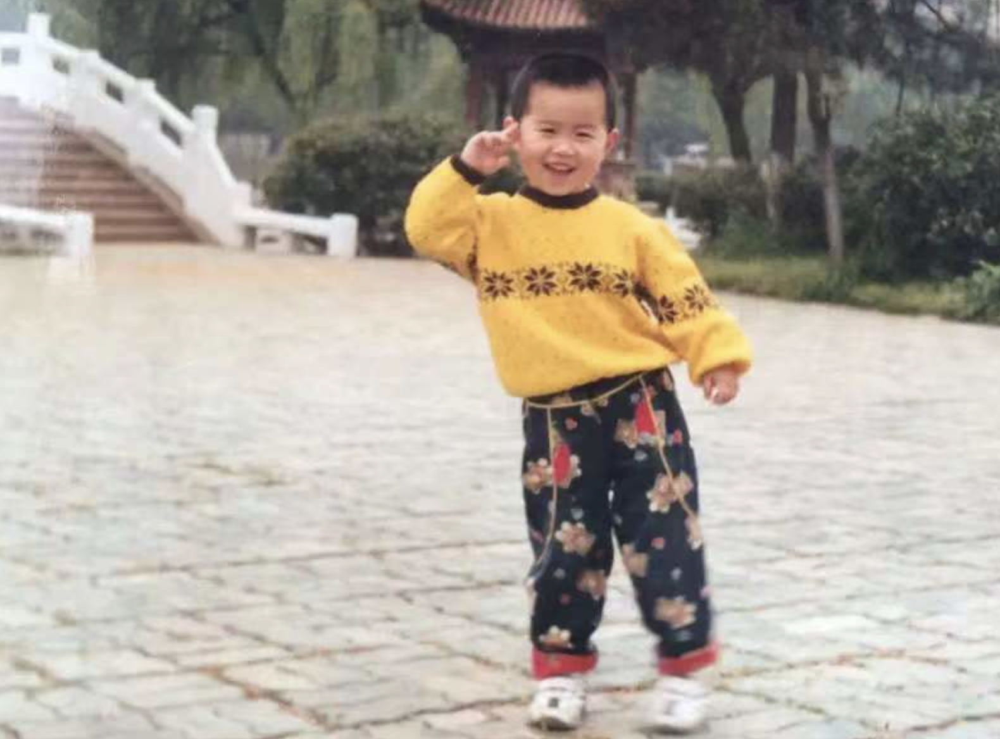

<table border="0">
  <tr>
    <td width="75%">
      <h1>Liu.Y</h1>
      
<b></b>

      
<b>中国科学院数学与系统科学研究院</b>

      
<b>邮箱：liuyang19971122@gmail.com</b>

      
<b>地址：北京市海淀区中关村，邮编000000</b>

    </td>
    <td width="25%">
       % 假装证件照
       % 就是证件照
    </td>
  </tr>
</table>

# Welcome to Liu.Y's Web Page

You can contact me if you are interested via [Zhihu](https://www.zhihu.com/people/ming-ren-19-34) or Email: liuyang2020@amss.ac.cn

I am for faculty or research intern positions starting from anytime! And Please contact me via email or wechat if you are interested in discussing any topics or working with me.

## About

Institute of Applied Mathematics

Academy of Mathematics and Systems Science

Chinese Academy of Sciences

### Education

 - Ph.D. Mathematics, 2022 – present, Academy of Mathematics and Systems Science

   Supervisor:  [Professor Chuan Zhou]()
    <!-- & [Zhiming Ma]() -->

 - Ph.D. Mathematics, 2020 – 2022, Academy of Mathematics and Systems Science

   Supervisor:  [Professor Chao Ding](http://www.dingchao.info) & [Professor Yangjin Zhang](https://sites.google.com/view/yangjingzhang/)

 - Exchange Student Mathematics, 2019, Michigan State University

   Supervisor:  [Professor Yuehua Cui](https://www.stt.msu.edu/~cui/)

 - Exchange  Student Mathematics , 2018, University of Alberta

   Supervisor:  Professor Eric Woolgar

 - B.S. Mathematics, 2016 – 2020, Xian Jiaotong University

   Supervisor:  [Professor Hui Li](http://gr.xjtu.edu.cn/web/lihui10 ) & [Professor Jiaqing Yang](http://gr.xjtu.edu.cn/web/jiasky )

### Research Interests

- Deep Learning
- Knowledge Graph and Reasoning
- Graph Embedding and Graph Nerual Networks
- Matrix Optimization with applications
- Optimization in machine learning and deep learning
- Optimization in statistics
- ...

### Experience

- New Oriental Education (Xi'an), 2019
- S. Capital, Data Analyst, 2020.1-2020.4.
- Research Assistant, Imagine Group, Xi'an Jiaotong University, 2019.6-2020.6.
- Xiaomi, Data Analyst-Financial quantification, 2021.5-2021.9
- SenceTime, AGI-NLP, 2022.1-2022.3
- BAAI, AI for science Researcher, supervisor: Qiwei Ye, Jie Fu and Wenhao Huang, 2022.3-2022.8
- Baidu, Researcher, supervisor: Huang Fang and Yunfeng Cai, 2022.8-Now
- ...

### Academy Service

- Reviewer
  - Conference: ICASSP23

### Talk

- XJTU, AMSS/CAS, XMU
- BAAI, Baidu Research

### Awards

- Outstanding Student Cadre, Academy of Mathematics and Systems Science of Chinese Academy of Sciences, 2021.
- Merit Student, Academy of Mathematics and Systems Science of Chinese Academy of Sciences, 2021.
- Freshman Scholarship, Academy of Mathematics and Systems Science of Chinese Academy of Sciences, 2021.
- Outstanding Graduates Award, Xi'an Jiaotong University, 2020.
- Outstanding Student Leaders Award, Xi'an Jiaotong University, 2020.
- Outstanding Students Award, Xi'an Jiaotong University, 2019, 2020.
- Zhufeng Scholarship, Xi'an Jiaotong University, 2019.
- First Prize of National College Student Innovation and Entrepreneurship Training Program, 2018.
- M prize of American Undergraduate Mathematical Contest in Modeling, 2018.
- First Prize of China Undergraduate Mathematical Contest in Modeling, 2017.

### Activities

- Chairman of the Student Union, School of Mathematical Sciences, Chinese Academy of Sciences, 2020-2021

- SIAM Member

- Datawhale Member 
  - [unusual-deep-learning](https://github.com/datawhalechina/unusual-deep-learning)
  - [Pages of unusual-deep-learning](https://datawhalechina.github.io/unusual-deep-learning)
  - [Video of unusual-deep-learning](https://www.bilibili.com/video/BV1iq4y197L4?spm_id_from=333.999.0.0)
  - [thorough-pytorch](https://github.com/datawhalechina/thorough-pytorch)
  - [Video of thorough-pytorch](https://www.bilibili.com/video/BV1L44y1472Z?spm_id_from=333.999.0.0)
  - [big-data](https://github.com/shenhao-stu/Big-Data)
  - [Pages of big-data](https://shenhao-stu.github.io/Big-Data)
  - [matrix-analysis](https://github.com/datawhalechina/team-learning-data-mining/tree/master/MatrixAnalysis)
  - optimization-algorithm(for Machine Learning)
  - operational-research
  - [beamer-datawhalestyle](https://github.com/liu-yang-maker/datawhale-beamer-zh-CN)
  
- 公众号：鸣也的小屋、优化算法交流地

## Codes

- [thorough-pytorch(datawhale)](https://github.com/datawhalechina/thorough-pytorch)
- [big-data(datawhale)](https://github.com/shenhao-stu/Big-Data)
- [beamer(datawhale)](https://github.com/liu-yang-maker/datawhale-beamer-zh-CN)
- [machine-learning](https://github.com/liu-yang-maker/Code-Machine-Learning)
- [deep-learning](https://github.com/liu-yang-maker/Code-Deep-Learning)
- [optimization-algorithm](https://github.com/liu-yang-maker/Code-Optimization-Algorithm)
- [intelligent-algorithm](https://github.com/liu-yang-maker/Code-Intelligent-Algorithm)
- [python](https://github.com/liu-yang-maker/Code-Python)
- [matlab](https://github.com/liu-yang-maker/Code-Matlab)
- [bio-stat](https://github.com/liu-yang-maker/Code-Bio-Statistics)

<!-- ## Papers -->

<!-- 
@article{LI2023104833,
title = {Development of a mixed reality method for underground pipelines in digital mechanics experiments},
journal = {Tunnelling and Underground Space Technology},
volume = {132},
pages = {104833},
year = {2023},
issn = {0886-7798},
doi = {https://doi.org/10.1016/j.tust.2022.104833},
url = {https://www.sciencedirect.com/science/article/pii/S0886779822004734},
author = {Wei Li and Yajian Wang and Hailu Yang and Zhoujing Ye and Pengpeng Li and Yang {Aron Liu} and Linbing Wang}
} -->

<!-- @misc{
lai2023does,
title={Does Structural Information have been Fully Exploited in Graph Data?},
author={Xin Lai and Yang Aron Liu and Rui Qian and Yong Lin and Qiwei Ye},
year={2023},
url={https://openreview.net/forum?id=fH4xGeqdgLb}
} -->

